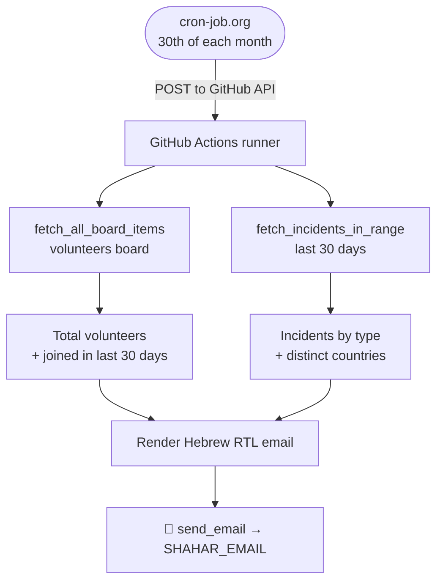

# Monthly Stats — Flow

## How it works

On the **30th of every month**, an external cron service (cron-job.org) triggers the workflow via
the GitHub API. The script pulls fresh numbers from Monday.com, builds a Hebrew (RTL) HTML report,
and emails it. There is no manual content — everything is computed automatically.

---

## Flow Diagram

---

## Metrics (all over the last 30 days)

| Metric | Source |
|---|---|
| **סה״כ מתנדבים** (total volunteers) | every item on the volunteers board (`VOLUNTEERS_BOARD_ID`) |
| **הצטרפו בחודש האחרון** (joined last month) | volunteers whose join date (`date4`, fallback `created_at`) is within 30 days |
| **אירועים לפי סוג** (incidents by type) | incidents board items in the window, grouped by `status_mkmb1zc6` |
| **מדינות פעילות** (countries) | distinct `country_mkmb91h3` values among those incidents |

> "Joined last month" is intentionally computed on a rolling **30-day** window (not the calendar month).

---

## Recipient

- **Production:** `SHAHAR_EMAIL` (GitHub secret / `.env`).
- **Testing:** pass an address as the first CLI argument to override —
  `python -m automations.monthly_stats.main you@example.com`.

---

## Required secrets / env

`MONDAY_API_KEY`, `BOARD_ID` (incidents board), `VOLUNTEERS_BOARD_ID`, `BREVO_API_KEY`,
`GMAIL_FROM`, `GMAIL_FROM_NAME`, `SHAHAR_EMAIL`.

---

## Scheduling note

Like the other automations, the workflow itself is `workflow_dispatch`-only — the **monthly** cadence
is configured in **cron-job.org** (set it to fire on the 30th), which calls the GitHub API to dispatch
the run. Update the schedule there, not in the workflow file.
