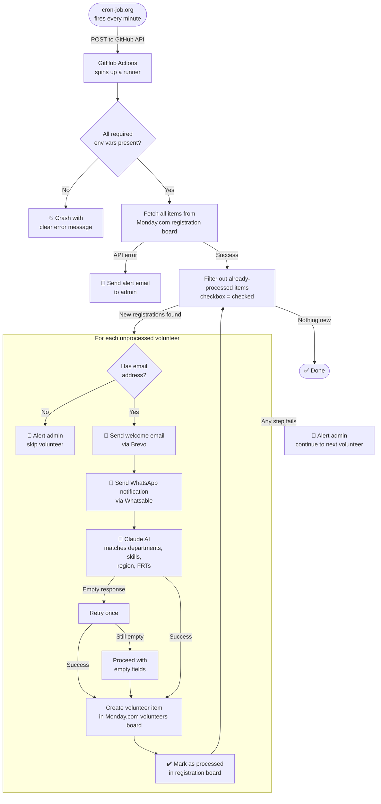

# Volunteer Onboarding — Flow

## How it works

Every minute, an external cron service triggers the automation via GitHub Actions.
The script checks Monday.com for new volunteer registrations, processes each one end-to-end, and marks it as done.

---

## Flow Diagram

---

## Components

| Component | Role |
|---|---|
| **cron-job.org** | Fires every minute, calls GitHub API to trigger the workflow |
| **GitHub Actions** | Runs the Python script on a Ubuntu runner |
| **Monday.com (registration board)** | Source of new volunteer registrations |
| **Monday.com (volunteers board)** | Destination — where processed volunteers are stored |
| **Brevo** | Sends the welcome email to the volunteer |
| **Whatsable** | Sends a WhatsApp notification to the team |
| **Claude AI** | Reads the volunteer's form and infers their departments, skills, region, and FRTs |

---

## What "processed" means

Each item on the registration board has a hidden checkbox column.
- **Unchecked** → not yet processed, will be picked up on the next run
- **Checked** → already processed, will be skipped forever

The checkbox is only marked **after all steps succeed**. If anything fails mid-way, the item stays unchecked and the next run retries it automatically.

---

## Error handling

If any step fails for a volunteer:
1. An alert email is sent to the admin with the full error details
2. The volunteer's checkbox stays unchecked → retried on the next run
3. The script continues processing the remaining volunteers

If fetching the board itself fails, an alert is sent and the entire run exits cleanly.
